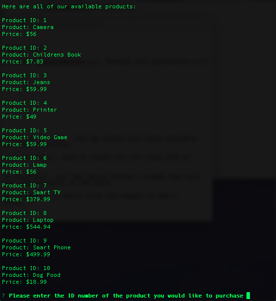
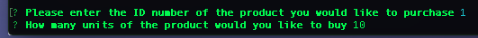
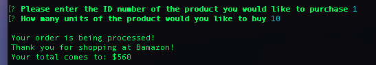

# Bamazon

This is a command line interface app created to help me work on my nodejs and MySQL skills.

To use the app start the JS file by typing 'node bamazonCustomer.js' into the command line

You will them be shown a list of products to choose from and prompted to choose a product using it's ID number

After providing an ID number you will be prompted to input the number of units you want:

If the product is available in the number of units you'd like you will be greeted with this screen:

If the number of units you would like is not available you will run into this screen:
